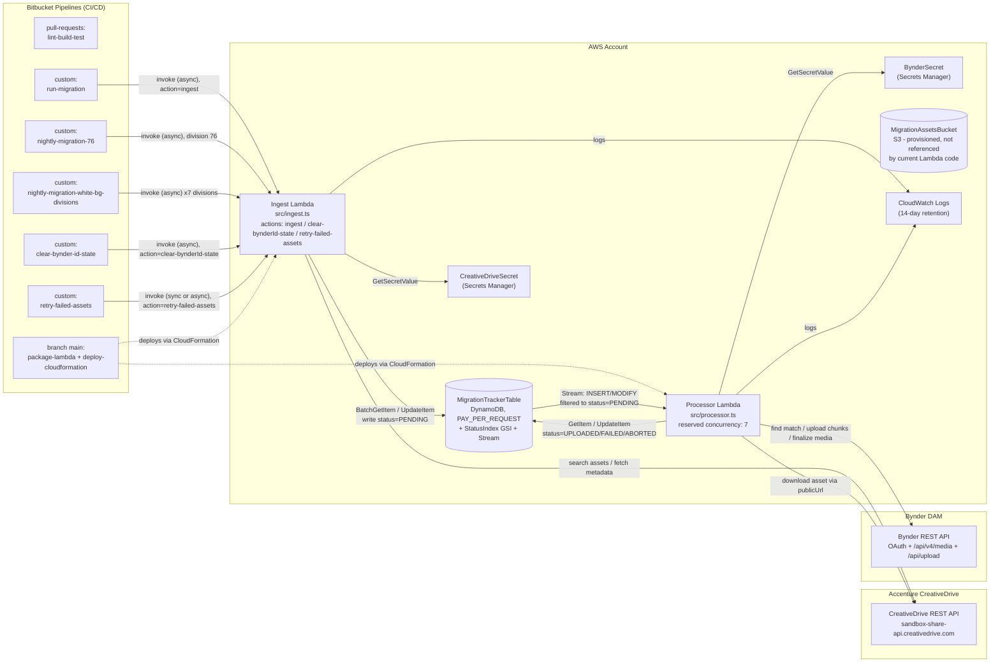

# Architecture

This document describes the actual current architecture of the CreativeDrive-to-Bynder migration system, grounded in the source code (`src/`) and the CloudFormation template (`cloudformation/infrastructure.yml`).
It supersedes the informal descriptions in the top-level `README.md` "Architecture" section and `infra_dia.mmd` where they had drifted from the real implementation; see [Known discrepancies with older docs](#known-discrepancies-with-older-docs) at the end.

## Overview

The system is a serverless, two-Lambda pipeline that moves digital assets from Accenture CreativeDrive into Bynder, using a DynamoDB table as the single source of truth for migration state:

1. **Ingest** - a Lambda queries the CreativeDrive API for assets and writes tracker records to DynamoDB with `status = PENDING`.
2. **Tracking** - DynamoDB (`MigrationTrackerTable`) holds one record per CreativeDrive asset and is the handoff point between ingest and processing.
3. **Processing** - a DynamoDB Stream (filtered to `PENDING` inserts/updates) triggers a second Lambda that downloads the asset from CreativeDrive directly into memory and uploads it to Bynder, then updates the tracker record's status.
4. **Bynder upload** - the processor either creates a new Bynder asset, adds a new version to an existing one, or attaches the file as an "additional file" on a matching asset, depending on business rules described below.

There is no persistent server or queue outside of AWS-managed services (Lambda, DynamoDB, DynamoDB Streams, Secrets Manager). Both Lambdas are invoked either by Bitbucket Pipelines (ingest) or by the DynamoDB Stream (processor).

## Diagram

## Components

### Ingest Lambda (`src/ingest.ts`)

Single Lambda, three dispatch actions selected by the `action` field on the event (default `ingest`):

- **`ingest`** (default) - the normal migration entry point, invoked by the `run-migration`, `nightly-migration-76`, and `nightly-migration-white-bg-divisions` pipelines. Runs a three-phase in-memory pipeline:
  1. **Fetch** - pages through CreativeDrive's `/search` endpoint in parallel batches (up to 20 concurrent requests, 1000 assets/page) honoring `maxAssets`/`fetchOffset`/date-range filters, or resolves specific `assetId`/`assetIds` directly.
  2. **Filter** - in `delta` mode, batch-checks DynamoDB and skips assets whose tracker status is already something other than `PENDING`; in `full` mode, all fetched assets are (re)processed.
  3. **Metadata + write** - fetches CreativeDrive asset metadata in parallel batches, then writes each asset to `MigrationTrackerTable` with `status = PENDING` via `updateCreativeDriveAssetRecord`.
- **`clear-bynderId-state`** - invoked by the `clear-bynder-id-state` custom pipeline. Fetches all assets for a given `divisionId`/`folderId` from CreativeDrive, and for any that already exist in the tracker table, removes the `bynderId` attribute and resets `status` to `PENDING` (see `docs/clear-bynder-id-state-pipeline.md`). Does not touch Bynder or CreativeDrive data itself.
- **`retry-failed-assets`** - invoked by the `retry-failed-assets` custom pipeline. Takes an explicit list of CreativeDrive asset IDs, re-fetches fresh signed download URLs from CreativeDrive (stored URLs expire), and resets matching `FAILED` tracker records to `PENDING` (see `docs/retry-failed-assets-pipeline.md`).

Credentials come from `CreativeDriveSecret` via `SecretsManagerClient`, read at invocation time (not cached across cold starts beyond the life of the container).

### Processor Lambda (`src/processor.ts`)

Triggered by an `AWS::Lambda::EventSourceMapping` on the DynamoDB Stream of `MigrationTrackerTable`, filtered server-side to `eventName IN (INSERT, MODIFY)` and `NewImage.status = PENDING` (batch size 10, `ReservedConcurrentExecutions: 7`). For each stream record:

1. Reads the tracker record by `creativeDriveAssetId`; skips anything that isn't `PENDING` (defensive check - a record can appear in a batch after already having been processed).
2. Delegates to `MigrationService.migrateAsset` (`src/lib/migration-service.ts`), which encodes the grey/white-background business rule:
   - **Division 76** is treated as the grey-background source of truth. Its assets are created as new Bynder assets (or new versions, if `bynderId` is already known) using style/color/angle codes parsed from the filename.
   - **All other divisions** (45, 46, 65, 89, 231, 232, 233 - see the white-BG pipeline below) are white-background variants that must attach as an "additional file" onto an existing grey-background Bynder asset, matched by `Style_Number` + original filename. If no match exists, the migration is **aborted** (not created standalone) and the tracker record is marked `ABORTED` with a reason.
   - If a Bynder asset already has an additional file, re-processing is skipped (`skipped: true`) to avoid duplicates - this is what makes `clear-bynderId-state` re-runs idempotent.
3. Downloads the asset bytes directly from CreativeDrive's signed `publicUrl` into an in-memory `Buffer` (`CreativeDriveClient.downloadAsset`) and uploads them to Bynder in 5 MB chunks (`BynderClient.uploadFile`), then finalizes the asset (new asset, new version, or additional file) and polls for completion.
4. Updates the tracker record's `status` to `UPLOADED` (with `bynderId`), `FAILED` (with `errorMessage`), or `ABORTED` (with `abortReason`).

Bynder OAuth credentials come from `BynderSecret`. Note that **no S3 bucket is used in this flow** - see [Known discrepancies](#known-discrepancies-with-older-docs).

### DynamoDB - `MigrationTrackerTable`

- **Partition key:** `creativeDriveAssetId` (String).
- **`StatusIndex` GSI:** `status` (hash) + `createdAt` (range) - provisioned in CloudFormation for status-scoped queries; not currently queried by any code path reviewed (ingest/processor both key on `creativeDriveAssetId` or scan via `BatchGetItem`).
- **Billing:** `PAY_PER_REQUEST`.
- **Stream:** `NEW_IMAGE`, consumed by the Processor Lambda's event source mapping.
- **Key attributes** (from `src/lib/dynamodb-client.ts`, `src/ingest.ts`, `src/processor.ts`):

  | Attribute | Description |
  |---|---|
  | `creativeDriveAssetId` | Partition key - CreativeDrive asset ID |
  | `status` | `PENDING`, `UPLOADED`, `FAILED`, or `ABORTED` |
  | `originalFilename`, `filesize`, `extension` | Source file attributes |
  | `folderId`, `divisionId` | CreativeDrive folder/division (division determines grey vs white background handling) |
  | `sourceUrl`, `publicUrl` | Download URLs (`publicUrl` is the signed URL actually downloaded from; can expire and needs refreshing via `retry-failed-assets`) |
  | `bynderId` | Bynder media ID once uploaded/matched |
  | `metadata` | Map of CreativeDrive metadata key/value pairs |
  | `migrationMode` | `full`, `delta`, or `update` - how the record was last written |
  | `errorMessage` / no equivalent for abort | Populated on `FAILED`; `ABORTED` records store their reason in `errorMessage` too (processor calls `updateAssetStatus(..., { errorMessage: result.abortReason })`) |
  | `createdAt`, `updatedAt` | ISO timestamps |

### Secrets Manager

Two secrets, both read at runtime via `GetSecretValueCommand` (never embedded in code or checked-in config):

- **`CreativeDriveSecret`** (`{ apiKey }`) - used by the Ingest Lambda.
- **`BynderSecret`** (`{ clientId, clientSecret, accessTokenUrl, apiBaseUrl }`) - used by the Processor Lambda for OAuth client-credentials auth against Bynder.

Both secret ARNs/values are populated from Bitbucket repository variables (`CREATIVEDRIVE_API_KEY`, `BYNDER_CLIENT_ID`, etc.) at CloudFormation deploy time.

### S3 - `MigrationAssetsBucket`

Provisioned in `cloudformation/infrastructure.yml` (versioned, SSE-encrypted, public access blocked), with the Processor Lambda's IAM role granted `s3:PutObject`/`s3:GetObject` on it. Current processor/migration-service code does not reference this bucket anywhere - assets are streamed from CreativeDrive to Bynder entirely in Lambda memory. Treat this as either a leftover from an earlier design or reserved for future use, not as an active part of the data path.

### CloudWatch

One log group per Lambda (`/aws/lambda/<project>-ingest-<env>`, `/aws/lambda/<project>-processor-<env>`), 14-day retention, created explicitly in CloudFormation so the Lambdas can `DependsOn` them.

## CI/CD (Bitbucket Pipelines)

Defined in `bitbucket-pipelines.yml`:

- **`pull-requests: '**'`** - runs `lint-build-test` (npm ci, build, test) on every PR. Linting itself is currently commented out in the step (`# - npm run lint`), so only build and test gate PRs today.
- **`branches: main`** - on push to `main`: `lint-build-test` -> `package-lambda` (zip `dist/` + `node_modules`) -> `deploy-cloudformation` (uploads the zip to the Lambda artifact S3 bucket, then `aws cloudformation deploy` of `cloudformation/infrastructure.yml`).
- **Custom pipelines** (manually triggered from the Bitbucket UI, or via Bitbucket's own Scheduled Pipelines feature for the two "nightly" ones - there is no schedule defined inside the YAML itself):
  - **`run-migration`** - general-purpose ingest trigger; exposes `MODE`, `MAX_ASSETS`, `DIVISION_ID`, `FOLDER_ID`, `ASSET_ID`, date-range filters, `DRY_RUN`.
  - **`clear-bynder-id-state`** - invokes `action=clear-bynderId-state` for a `DIVISION_ID`/`FOLDER_ID` pair.
  - **`retry-failed-assets`** - invokes `action=retry-failed-assets` for a pasted/file-sourced list of asset IDs.
  - **`nightly-migration-76`** - fixed payload for division 76 (grey background), `mode=full`, `syncLastDays=1`, `maxAssets=5000`.
  - **`nightly-migration-white-bg-divisions`** - loops the same payload shape across the seven white-background divisions (45 HBSLG, 46 Footwear, 65 RTW, 89 Licensed, 231 MKC ACC, 232 MKC Footwear, 233 MKC RTW).

All pipelines invoke the Ingest Lambda via `aws lambda invoke` (async `Event` invocation for most; `retry-failed-assets` defaults to synchronous `RequestResponse` so its result prints directly in the Bitbucket step log). The Processor Lambda is never invoked directly by a pipeline - it only runs off the DynamoDB Stream.

## Known discrepancies with older docs

While writing this doc, the following gaps were found between the existing `README.md` / `infra_dia.mmd` and the current code/CloudFormation. Noted here rather than silently perpetuated:

- **README says the processor "simulates" the Bynder upload** ("ready for actual Bynder API integration"). This is stale: `src/lib/bynder-client.ts` and `src/lib/migration-service.ts` implement a real, fairly involved Bynder upload/match/attach flow.
- **README's "direct upload, no S3 intermediate" claim is only half true.** The processor genuinely doesn't use S3 in its data path, but CloudFormation still provisions `MigrationAssetsBucket` and grants the processor S3 permissions that are unused by current code - the README doesn't mention this bucket exists at all.
- **README's status list is incomplete.** It documents `PENDING`/`UPLOADED`/`FAILED` only; the processor also sets `ABORTED` for white-background assets that have no matching grey-background Bynder asset.
- **`infra_dia.mmd` is missing most of the current system**: Secrets Manager is shown as one box (there are two distinct secrets), there's no S3 bucket, no `StatusIndex` GSI, no CloudWatch/IAM detail, and none of the `clear-bynder-id-state`, `retry-failed-assets`, or nightly pipelines are represented - only the original `run-migration` flow.
- **`src/config.ts` is a dead stub** ("should be mocked in tests") that is not imported anywhere in `src/`; both Lambdas read `process.env` directly instead. Not part of the real config path despite its name.
- The CloudFormation template has a dangling comment (`# EventBridge schedule for Sync Lambda`) with no corresponding resource - scheduling for the nightly pipelines is handled entirely by Bitbucket, not EventBridge.
